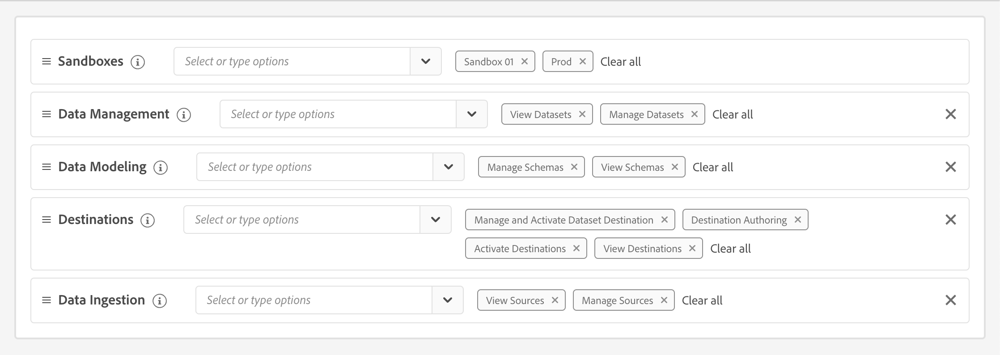
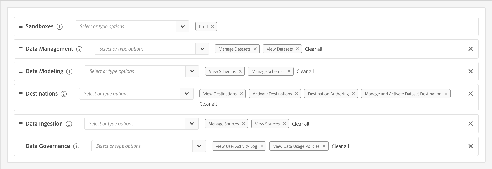

# 관리

사용 [Adobe Admin Console](https://helpx.adobe.com/enterprise/using/admin-console.html) Mix Modeler 제품 및 사용자를 관리합니다.

Mix Modeler이 제대로 작동하려면 올바른 권한을 설정해야 합니다.

Adobe Experience Cloud UI에서,

1. 선택 **[!UICONTROL Permissions]** 왼쪽 레일에서 아래 **[!UICONTROL ADMINISTRATION]**.

1. 선택  **[!UICONTROL Roles]** 왼쪽 패널에서 가져옵니다.

1. 기존 역할을 선택하거나 다음을 사용하여 역할을 만듭니다 **[!UICONTROL Create role]**. 기존 역할을 선택하는 경우 다음을 선택합니다  **[!UICONTROL Edit]** 을 눌러 역할에 대한 권한을 편집합니다. 다음을 참조하십시오 [역할 관리](https://helpx.adobe.com/enterprise/using/admin-console.html) 추가 정보.

1. 역할에 대해 다음 권한을 선택해야 합니다.

   * **[!UICONTROL Sandboxes]**: 샌드박스를 하나 이상 선택합니다.

   * **[!UICONTROL Data Management]**: 옵션을 선택해야 합니다. **[!UICONTROL View Datasets]** 및 **[!UICONTROL Manage Datasets]**.

   * **[!UICONTROL Data Modeling]**: 옵션을 선택해야 합니다. **[!UICONTROL Manage Schemas]** 및 **[!UICONTROL View Schemas]**.

   * **[!UICONTROL Destinations]**: 다음을 선택해야 합니다. **[!UICONTROL Manage and Activate Dataset Destination]**, **[!UICONTROL Destination Authoring]**, **[!UICONTROL Activate Destinations]** 및 **[!UICONTROL View Destinations]**.

   * **[!UICONTROL Data Ingestion]**: 다음을 선택해야 합니다. **[!UICONTROL View Sources]** 및 **[!UICONTROL Manage Sources]**.

   <!--
    * **[!UICONTROL Data Governance]**: ensure you select **[!UICONTROL View User Activity Log]** and **[!UICONTROL View Data Usage Policies]**.
    -->

   역할에 대해 설정된 권한은 다음과 같아야 합니다.

   

   <!---->

   선택 **[!UICONTROL Save]** 사용 권한을 저장합니다.

1. 위치 **[!UICONTROL Details]** 다음 범위 내 **[!UICONTROL Role]**&#x200B;을 클릭하고 적절한 을(를) 추가합니다. **[!UICONTROL Users]** 및/또는 **[!UICONTROL User groups]** 사용자에게 Mix Modeler에 대한 액세스 권한을 제공합니다.
