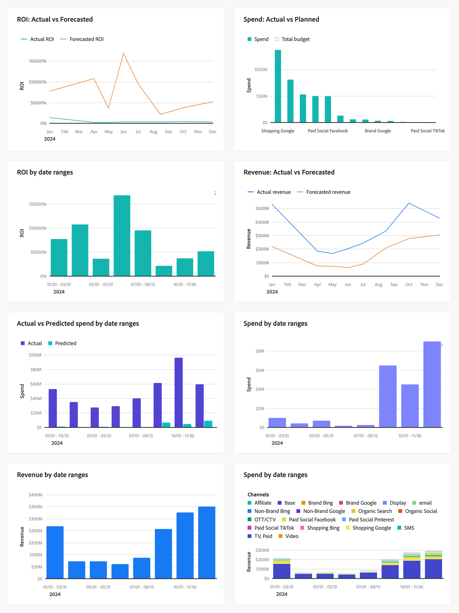

# 계획 성과

>[!NOTE]
>
>Mix Modeler **[!UICONTROL Performance to plan]** Home[!BADGE  ]{type=Informative}의 Beta **[!UICONTROL Overview]** 탭은 Beta 기능이며 기능은 변경될 수 있습니다. 이 기능은 제한된 수의 고객이 사용할 수 있습니다.

Mix Modeler **[!UICONTROL Plans]** Home[!BADGE  ]{type=Informative}의 Beta **[!UICONTROL Overview]** 탭은 계획에 대한 마케팅의 성과를 모니터링하는 추적 대시보드를 제공합니다. 상태 카드 및 시각화를 통해 실제 성능과 계획된 성과를 추적할 수 있습니다.

대시보드를 통해 격차, 위험 또는 기회를 파악하고 계획 및 예산을 시기 적절하게 조정할 수 있습니다.

KPI 상태 카드 및 시각화에 대해 표시되는 데이터를 선택하려면 다음과 같이 하십시오.

* **[!UICONTROL Plan name]**&#x200B;옵션 선택...**[!UICONTROL _을 사용하여_]** 드롭다운 메뉴에서 계획을 선택하십시오.

* 날짜 기간을 지정합니다. 날짜 기간을 변경하려면 시작 날짜와 종료 날짜를 수동으로 입력하거나 을 사용하여 날짜 기간을 선택하십시오.

**[!UICONTROL Plans]** [!BADGE Beta]{type=Informative} 탭에는 다음이 표시됩니다.

* [KPI 상태 카드](#kpi-status-cards):

   * [예산](#budget)
   * [매출](#revenue)
   * [ROI](#roi)
   * [KPI](#kpi)

* [시각화](#visualizations):
   * [*지표*](#metric-actual-vs-planned)
   * [*지표*](#metric-actual-vs-planned-by-granularity)
   * [채널 ](#channel-metric-by-granularity)
   * [*지표*](#metric-vs-metric-by-channel)
   * [*지표*](#metric-by-granularity)
   * [*지표*](#metric-by-channel)

## KPI 상태 카드

### 예산

날짜 기간에 대한 플랜 예산과 마케팅 지출이 어떻게 비교되는지 표시하는 순환 진행률 시각화입니다.

### 매출

날짜 기간에 대해 계획된 대상 매출과 실제 매출액이 어떻게 비교되는지 표시하는 순환 진행 시각화입니다.

### ROI

날짜 기간에 대한 ROI를 표시하는 라인 시각화입니다.

### KPI

날짜 기간에 대한 KPI를 표시하는 라인 시각화입니다.

다른 KPI를 선택하려면 다음과 같이 하십시오.

1. 을 선택합니다.
1. **[!UICONTROL KPI status card]** 대화 상자의 **[!UICONTROL KPI]** 드롭다운 메뉴에서 KPI를 선택합니다. 사용 가능한 옵션은 [!UICONTROL Conversions], [!UICONTROL CPA], [!UICONTROL Revenue], [!UICONTROL ROI] 및 [!UICONTROL Spend]입니다.

## 시각화

6개의 시각화를 사용할 수 있으며 6개의 시각화를 각각 편집할 수 있습니다.

시각화 크기를 조정하려면 오른쪽 하단에 있는 ┛ 핸들을 사용하십시오. 시각화를 이동하려면 시각화를 원하는 위치로 끌어서 놓기만 하면 됩니다.

시각화의 모든 선, 막대 또는 분산형 요소 위에 마우스를 가져다 대면 추가 정보가 포함된 팝업을 표시할 수 있습니다.

### *지표*: 실제 및 계획된 비교

현재까지, 계획된 현재까지 및 합계에 대해 선택한 지표 값을 비교하는 스택 막대 시각화입니다.

### *지표*: 실제 대 *세부기간*&#x200B;에 의해 계획된 대

선택한 지표 및 선택한 세부 기간에 대한 실제 및 계획된 값을 표시하는 선 시각화입니다.

### *세부 기간*&#x200B;별 채널 *지표*

선택한 지표 및 선택한 세부 기간에 대한 채널을 표시하는 스택 막대를 표시하는 스택 막대 시각화입니다.

### 채널별 *지표*&#x200B;와 *지표* 비교

선택한 지표에서 채널에 대한 산포도를 표시하는 산포도 시각화입니다.

### *세부 기간*&#x200B;별 *지표*

선택한 지표에 대한 실제 및 계획된 값을 표시하는 막대 시각화입니다.

### 채널별 *지표*

선택한 세부 기간에 대해 선택한 지표를 표시하는 여러 줄 시각화입니다.

### 시각화 편집

시각화를 편집하려면:

1. 을 선택하여 **[!UICONTROL Edit data]** 대화 상자를 엽니다.
1. 시각화에 따라 다음을 변경할 수 있습니다.

   * 하나 또는 두 개의 지표: **[!UICONTROL Select metric]** 드롭다운 메뉴에서 지표를 선택합니다.

      * ROI 기반 계획의 경우 옵션은 [!UICONTROL Conversions], [!UICONTROL CPA], [!UICONTROL Revenue], [!UICONTROL ROI], [!UICONTROL Spend] 및 [!UICONTROL Volume]입니다.
      * CPA 기반 계획의 경우 옵션은 [!UICONTROL Conversions], [!UICONTROL CPA], [!UICONTROL Spend] 및 [!UICONTROL Volume]입니다.
   * **[!UICONTROL Granularity]**: **[!UICONTROL date ranges]** 드롭다운 메뉴에서 **[!UICONTROL week]** 또는 **[!UICONTROL Granularity]**&#x200B;을(를) 선택합니다.

   **[!UICONTROL Preview]**&#x200B;에서 변경 내용이 **[!UICONTROL Current]** 시각화와 어떻게 다른지 확인할 수 있습니다.

1. **[!UICONTROL Apply]**&#x200B;을(를) 선택하여 변경 내용을 적용합니다. 시각화에 대한 변경 내용을 취소하려면 **[!UICONTROL Cancel]**&#x200B;을(를) 선택하십시오.
