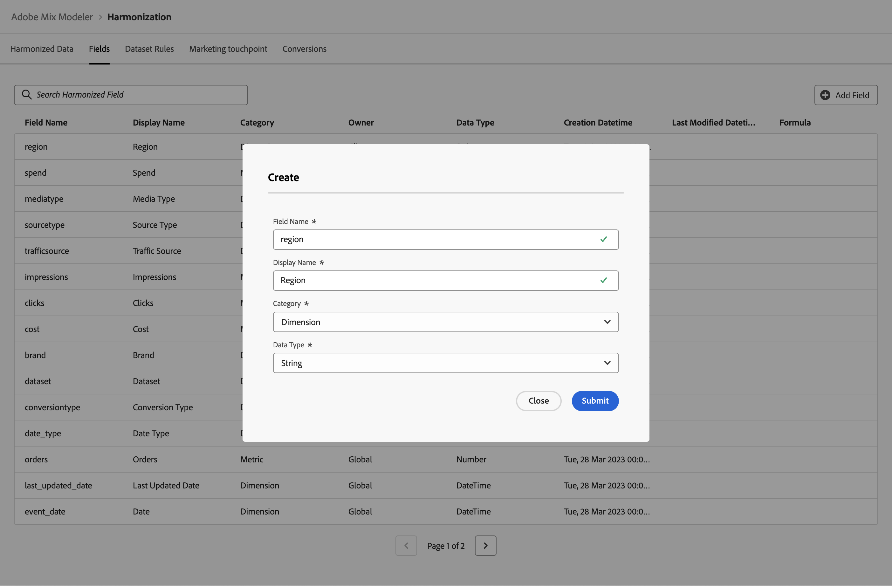

# 조화된 필드

조화된 필드를 사용하면 서로 다른 소스에서 가져온 동일한 데이터에 대해 해당 데이터에 대한 자체 정의를 사용하여 개념적으로 동일한 데이터에 대한 필드를 정의할 수 있습니다. 예를 들어 클릭 지표는 데이터 소스에 따라 다르게 정의되고 명명될 수 있습니다. 클릭 수 조화 필드를 사용하면 클릭 수의 서로 다른 소스 데이터를 기반으로 클릭 수에 대한 일반적인 명명법을 정의할 수 있습니다.

조화된 필드를 사용하면 데이터 통합 워크플로의 일부로 사용할 필드를 정의할 수 있습니다. 정의하는 필드는 데이터 세트 규칙, 마케팅 접점 및 전환을 정의하는 데 사용할 수 있습니다.

## 전역 조화 필드

Mix Modeler에서 기본적으로 사용할 수 있는 전역 조화 필드는 다음과 같습니다.

| 필드 이름 | 표시 이름 | 카테고리 | 데이터 유형 | 댓글 |
| ---------------------- | ---------------------- | --------- | --------- | --------- |
| 브랜드 | 브랜드 | 차원 | 문자열 |           |
| campaign | Campaign | 차원 | 문자열 |           |
| channel | 채널 | 차원 | 문자열 |           |
| channel_id | 채널 ID | 차원 | 문자열 |           |
| channel_type_at_source | 소스에서의 채널 유형 | 차원 | 문자열 |           |
| channel | 채널 | 차원 | 문자열 |           |
| 클릭수 | 클릭수 | 지표 | 숫자 |           |
| 전환 유형 | 전환 유형 | 차원 | 문자열 |           |
| 비용 | 비용 | 지표 | 통화 |           |
| 데이터 세트 | 데이터 세트 | 차원 | 문자열 |           |
| date_type | 날짜 유형 | 차원 | 문자열 | 일, 주 |
| emailsent | 이메일 전송됨 | 지표 | 숫자 |           |
| event_date | 날짜 | 차원 | DateTime |           |
| gross_demand | 총 수요 | 지표 | 통화 |           |
| 노출 횟수 | 노출 횟수 | 지표 | 숫자 |           |
| last_updated_date | 마지막으로 업데이트한 날짜 | 차원 | DateTime |           |
| linkvisits | 방문 횟수 연결 | 지표 | 숫자 |           |
| mediatype | 미디어 유형 | 차원 | 문자열 |           |
| net_sales | 순 판매 | 지표 | 통화 |           |
| 주문 수 | 주문 수 | 지표 | 숫자 |           |
| sourcetype | 소스 유형 | 차원 | 문자열 |           |
| 지출 | 지출 | 지표 | 통화 |           |
| trafficsource | 트래픽 소스 | 차원 | 문자열 |           |

{style="table-layout:auto"}

이러한 전역 조화 필드 위에 자신의 조화 필드를 추가, 편집 또는 삭제할 수 있습니다.

## 조화로운 필드 관리

Mix Modeler 인터페이스에서 사용 가능한 조화 필드의 표를 보려면 다음을 수행하십시오.

1. 선택  **[!UICONTROL Harmonized data]** 왼쪽 레일에서.

1. 선택 **[!UICONTROL Fields]** 을 클릭합니다. 여러분은 조화된 들판의 표를 볼 수 있습니다. 사용 가능한 페이지가 더 있으면 다음을 사용합니다.  또는  위치: **[!UICONTROL Page _x _/_x_]** 을 눌러 테이블의 페이지 사이를 이동합니다.

   테이블 열은 조화된 필드에 대한 세부 사항을 지정합니다

   | 열 이름 | 세부 사항 |
   | ---------------------- | ----------|
   | 필드 이름 | 조화된 필드의 이름. |
   | 표시 이름 | 조화된 필드의 표시 이름입니다. 이 표시 이름은 데이터 세트 규칙, 마케팅 접점 및 전환 정의를 정의할 때 사용됩니다. |
   | 카테고리 | Harmonized 데이터 필드가 인지 여부 지정 [!UICONTROL Dimension], a [!UICONTROL Metric] 또는 [!UICONTROL Derived]. 파생 카테고리는 지표 기반 공식 정의를 사용하는 조화로운 필드입니다. |
   | 데이터 유형 | 데이터 형식을 지정합니다([!UICONTROL Number], [!UICONTROL String], [!UICONTROL Currency], [!UICONTROL DateTime]). |
   | 제작일 | 조화로운 필드를 만든 날짜 및 시간입니다. |
   | 소유자 | 조화 필드가 기본 필드인지 여부를 나타냅니다. ([!UICONTROL Global]) 또는 는 사용자가 정의합니다([!UICONTROL Client]). |
   | 마지막으로 수정한 날짜 | 조화 필드의 마지막 수정 날짜 및 시간입니다. |
   | 공식 | 파생 범주를 기반으로 조화 필드의 수식을 지정합니다. |

   {style="table-layout:auto"}

1. 특정 조화로운 필드를 검색하려면  **[!UICONTROL *Harmonized 필드 검색&#x200B;*]**.

### 조화로운 필드 추가

조화로운 필드를 추가하려면  **[!UICONTROL Harmonized data]** > **[!UICONTROL Fields]** Mix Modeler 인터페이스:

1. 선택  **[!UICONTROL Add field]**.

1. 다음에서 **[!UICONTROL Create]** 대화 상자:

   1. 입력 **[!UICONTROL Field name]**, 예 `region`.
   1. 입력 **[!UICONTROL Display name]**, 예 `Region`.
   1. 선택 **[!UICONTROL Category]**: **[!UICONTROL Dimension]**, **[!UICONTROL Metric]** 또는 **[!UICONTROL Derived]**.

      다음을 선택할 때 **[!UICONTROL Derived]**, 지정 **[!UICONTROL Formula]**. 유효한 산술 표현식을 작성하려면 다음 위치에서 하나 이상의 지표를 결합하십시오. **[!UICONTROL Insert Metric]** 하나 이상의 연산자 사용 **[!UICONTROL + - * / ( )]** . For example, `[orders]/[impressions]`

   1. 선택 **[!UICONTROL Data type]**.

      - **[!UICONTROL String]** 또는 **[!UICONTROL DateTime]**: 선택한 카테고리가 Dimension 인 경우.
      - **[!UICONTROL Number]** 또는 **[!UICONTROL Currency]** 선택한 범주가 지표 또는 파생인 경우.

   1. 선택 **[!UICONTROL Submit]** 을 클릭하여 harmonized 필드를 추가합니다. 선택 **[!UICONTROL Close]** 을 클릭하여 harmonized 필드를 추가하지 않고 대화 상자를 닫습니다.

      

### 조화로운 필드 편집

이전에 만든 통합 필드만 편집할 수 있습니다(소유자는 클라이언트임). 전역 조화 필드를 편집할 수 없습니다.

조화된 필드를 편집하려면  **[!UICONTROL Harmonized data]** > **[!UICONTROL Fields]** Mix Modeler 인터페이스:

1. 편집할 조화로운 필드를 선택합니다. 예: **[!UICONTROL Region]**.

1. 다음에서 **[!UICONTROL Edit harmonization values]** 창, 값 수정 **[!UICONTROL Display name]**, **[!UICONTROL Category]**, 및 **[!UICONTROL Data type]**. 다음을 참조하십시오 [조화로운 필드 추가](#add-a-harmonized-field) 추가 정보.

1. 선택 **[!UICONTROL Submit]** 를 클릭하여 변경 내용을 harmonized 필드에 적용합니다.

   

### 조화로운 필드 삭제

이전에 만든 조화로운 필드만 삭제할 수 있습니다(소유자는 클라이언트임). 전역 조화된 필드는 삭제할 수 없습니다.

조화된 필드를 삭제하려면  **[!UICONTROL Harmonized data]** > **[!UICONTROL Fields]** Mix Modeler 인터페이스:

1. 삭제할 조화로운 필드를 선택합니다(예: ). **[!UICONTROL Region]**.

1. 선택  **[!UICONTROL Delete]** 다음에서 **[!UICONTROL Edit harmonization values]** 왼쪽 창입니다.

   >[!WARNING]
   >
   >   필드가 즉시 삭제됩니다.

