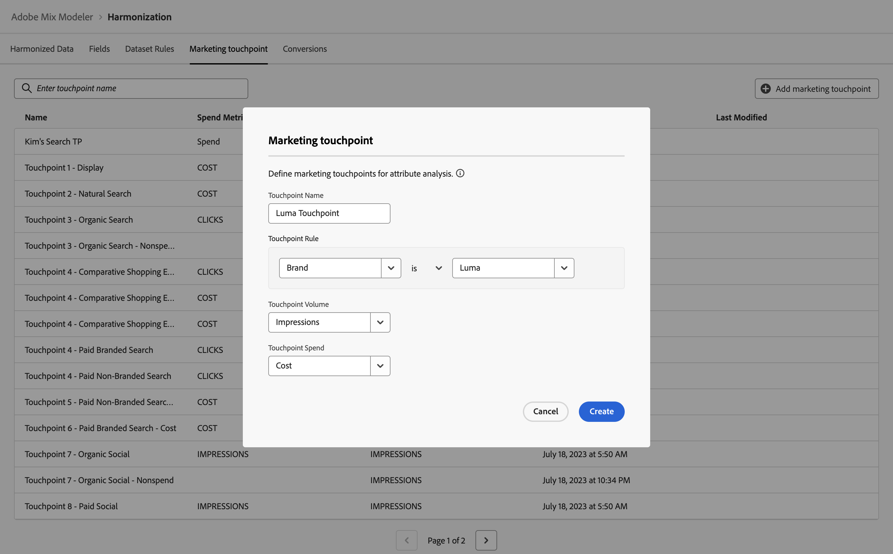

# 마케팅 접점

마케팅 접점은 마케팅 투자가 숫자 또는 수익 기반 전환에 미치는 영향을 평가하는 데 사용되는 수신자, 개인 및/또는 쿠키 수준 마케팅 이벤트입니다.

속성 분석을 지원하는 마케팅 접점을 정의합니다.

## 마케팅 접점 관리

Adobe 믹스 모델러 인터페이스에서 사용 가능한 마케팅 터치포인트의 테이블을 보려면 다음을 수행하십시오.

1. 선택  **[!UICONTROL Harmonized data]** 왼쪽 레일에서.

1. 선택 **[!UICONTROL Marketing touchpoint]** 을 클릭합니다. 마케팅 접점 테이블이 표시됩니다.

테이블 열은 마케팅 접점에 대한 세부 사항을 지정합니다.

| 열 이름 | 세부 사항 |
| --- | ---|
| 이름 | 마케팅 접점 이름입니다. |
| 지출 지표 | 접점 지출을 계산하는 데 사용할 조정된 데이터 지표입니다. |
| 볼륨 지표 | 접점 볼륨을 계산하는 데 사용할 조정된 데이터 지표입니다. |
| 생성일 | 마케팅 접점 생성 날짜 및 시간입니다. |
| 마지막 수정일 | 마케팅 접점을 마지막으로 수정한 날짜 및 시간입니다. |

{style="table-layout:auto"}

## 마케팅 접점 추가

마케팅 접점을 추가하려면  **[!UICONTROL Harmonized data]** > **[!UICONTROL Marketing touchpoint]** Adobe 믹스 모델러의 인터페이스:

1. 선택  마케팅 접점 추가.

1. 다음에서 **[!UICONTROL Marketing touchpoint]** 대화 상자.

   1. 이름 입력 **[!UICONTROL Touchpoint Name]**, 예 `Luma Touchpoint`.

   1. 정의 **[!UICONTROL Touchpoint rule]**.

      1. 다음에서 값 선택 **[!UICONTROL *조화 선택...*]**, 예&#x200B;**[!UICONTROL Brand]**.

      1. 연산자 값 선택 , 예 **[!UICONTROL is]**.

      1. 다음에서 값 선택 **[!UICONTROL *값 선택&#x200B;*]**또는 값을 입력합니다(예: ).**[!DNL Luma]**.

   1. 다음 위치에서 조화로운 필드 선택 **[!UICONTROL Touchpoint volume]**, 예 **[!UICONTROL Impressions]**.

   1. 다음 위치에서 조화로운 필드 선택 **[!UICONTROL Touchpoint spend]**, 예 **[!UICONTROL Cost]**.

      

   1. 마케팅 접점을 만들려면 다음을 선택합니다. **[!UICONTROL Create]**. 마케팅 접점 만들기를 취소하려면 **[!UICONTROL Cancel]** .

1. 터치포인트를 만들면 마케팅 터치포인트 테이블에 터치포인트가 추가됩니다.

