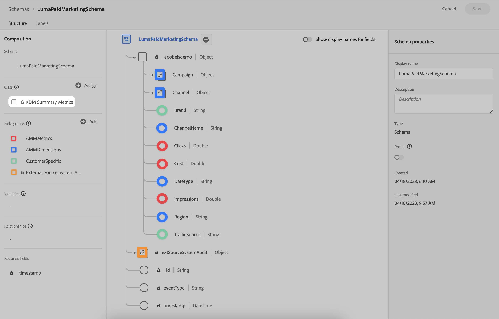

# 스키마

Adobe Experience Platform에서 수집하고 Adobe 믹스 모델러에서 사용할 데이터를 지원하여 스키마를 관리하려면 다음 작업을 수행하십시오.

1. Adobe 믹스 모델러 인터페이스로 이동합니다.

1. 선택  **[!UICONTROL Schemas]**, 그 아래 **[!UICONTROL DATA MANAGEMENT]**.

다음을 참조하십시오. [스키마 UI 개요](https://experienceleague.adobe.com/docs/experience-platform/xdm/ui/overview.html?lang=en) 추가 정보.

## 집계 또는 요약 데이터

XDM 요약 지표 클래스를 Experience Platform에서 수집하고 Adobe 믹스 모델러에서 사용할 집계 또는 요약 데이터의 기초가 되는 스키마의 기반으로 사용하는 것이 좋습니다.

XDM 요약 지표 클래스 사용:

- 담으로 둘러싸인 정원 데이터(예: Facebook 또는 YouTube 데이터)

- SPX(S&amp;P 500 주가 지수), 날씨 데이터 등의 외부 요인 데이터,

- 내부 요소 데이터(예: 가격 변경, 휴일 달력).

>[!IMPORTANT]
>
>수집된 데이터에 필요한 지표를 지원하려면 스키마 정의에 하나 이상의 숫자 필드(정수, Double, 부울 또는 기타 숫자 유형 사용)가 포함되어야 합니다.

를 사용하는 스키마 **[!DNL XDM Summary Metrics]** 기본 클래스는 다음과같이 간단할 수 있습니다. **[!DNL ExternalFactorSummarySchema]** 아래요.

이 간단한 스키마를 사용하여 다음에 대한 데이터가 포함된 데이터 세트를 수집할 수 있습니다.

- 경쟁업체 인덱스 데이터

  | 타임스탬프 | date_type | 요소 | 값 |
  |---|---|---|--:|
  | 2020년 11월 28일:00:00.000Z | 주 | competitor_index | 289.8 |
  | 2020년 12월 5일:00:00.000Z | 주 | competitor_index | 291.2 |
  | 2020년 12월 12일:00:00.000Z | 주 | competitor_index | 280.07 |
  | ... | ... | ... | ... |

- 공휴일 데이터

  | 타임스탬프 | date_type | 요소 | 값 |
  |---|---|---|--:|
  | 2020년 11월 28일:00:00.000Z | 주 | all_holidays_flag | 0.0 |
  | 2020년 12월 5일:00:00.000Z | 주 | all_holidays_flag | 0.0 |
  | 2020년 12월 12일:00:00.000Z | 주 | all_holidays_flag | 0.0 |
  | 2020년 12월 19일:00:00.000Z | 주 | all_holidays_flag | 0.0 |
  | 2020년 12월 26일:00:00.000Z | 주 | all_holidays_flag | 1.0 |
  | ... | ... | ... | ... |

의 보다 포괄적인 예는 아래 를 참조하십시오. **[!DNL LumaPaidMarketingSchema]** 사용 **[!DNL XDM Summary Metrics]** 를 기본 클래스로 사용합니다. 스키마는 지표 ( )에 전용 필드 그룹 ( 색상으로 주석 처리 됨)을 사용합니다.**[!DNL AMMMetrics]**), 차원 (**[!DNL AMMDimensions]**) 및 기타 고객별 정보(**[!DNL CustomerSpecific]**).

프로필 수집의 비동기적 특성을 고려하여 외부 소스에서 합계 또는 요약 데이터를 수집할 때 외부 소스 시스템 감사 세부 정보 필드 그룹을 스키마의 일부로 사용하는 것이 좋습니다. 이 필드 그룹은 외부 소스에 대한 감사 속성 집합을 정의합니다.
