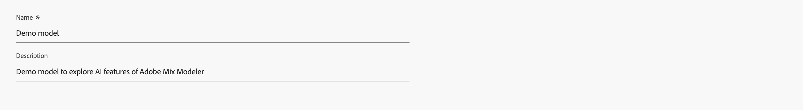
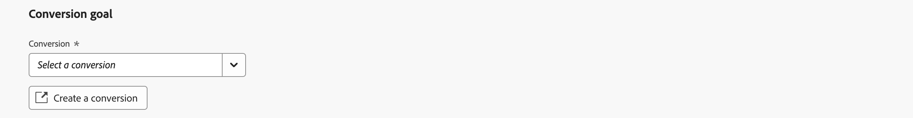
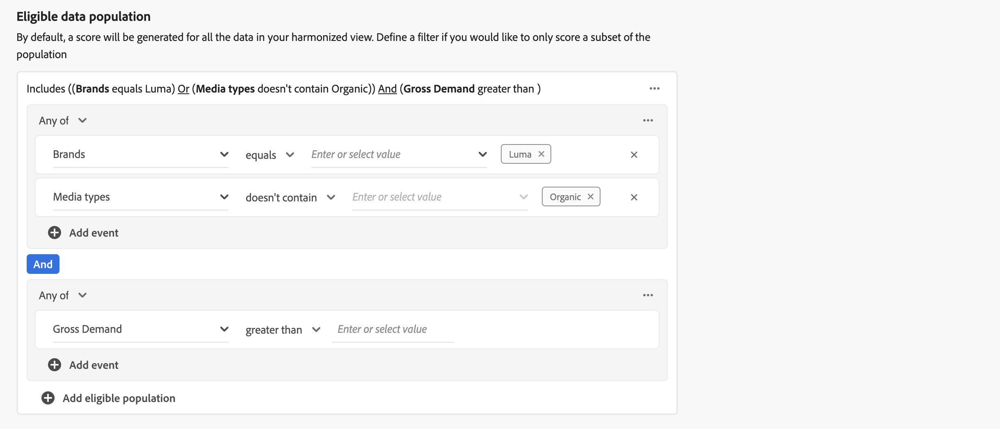

# 모델 만들기

모델을 만들려면  **[!UICONTROL Models]** Mix Modeler에서 인터페이스, 선택 **[!UICONTROL Guide me]**.

사용자 지정 AI 기반 모델을 구축하기 위해 인터페이스는 단계별 가이드 모델 구성 플로우를 제공합니다.

1. 다음에서 **[!UICONTROL Setup]** 단계:

   1. 모델 입력 **[!UICONTROL Name]**, 예 `Demo model`. 입력 **[!UICONTROL Description]**, 예 `Demo model to explore AI featues of Mix Modeler`.

      

   1. 선택 **[!UICONTROL Next]** 을 클릭하여 다음 단계로 이동합니다. 선택 **[!UICONTROL Cancel]** 모델 구성을 취소합니다.

1. 다음에서 **[!UICONTROL Configure]** 단계:

   1. 다음에서 **[!UICONTROL Conversion goal]** 섹션, 컨테이너 내:

      1. 입력 **[!UICONTROL Conversion name]** 전환용 예 `Conversion`

      1. 다음에서 전환 선택 **[!UICONTROL *Harmonized 필드 선택&#x200B;*]**를 포함하며, 의 일부로 정의한 사용 가능한 전환을 포함합니다. [전환](../harmonize-data/conversions.md) 위치: [!UICONTROL Harmonized datasets]. For example,**[!UICONTROL Online Conversion]**.

      1. 다음을 선택할 수 있습니다.  **[!UICONTROL Create new conversion]** 모델 구성 내에서 직접 변환을 만들 수 있습니다.

         

   1. 다음에서 **[!UICONTROL Marketing touchpoints]** 섹션에는 일부로 정의한 마케팅 터치포인트에 해당하는 많은 마케팅 터치포인트 컨테이너가 표시됩니다. [마케팅 접점](../harmonize-data/marketing-touchpoints.md) 위치: [!UICONTROL Harmonized datasets].

      * 각 컨테이너의 경우:

         1. 다음을 수정할 수 있습니다. **[!UICONTROL Marketing touchpoint name]**.

         1. 에서 마케팅 접점 선택 **[!UICONTROL _마케팅 접점 선택_]**.

         1. 다음을 선택할 수 있습니다.  **[!UICONTROL Create new marketing touchpoint]** 모델 구성 내에서 직접 마케팅 접점을 만듭니다.

      * 마케팅 접점 컨테이너를 추가하려면  **[!UICONTROL Add marketing touchpoint]**.

      * 마케팅 접점 컨테이너를 제거하려면 컨테이너 내에서 을 선택합니다.  및 선택 **[!UICONTROL Remove container]** 컨텍스트 메뉴 아래의 제품에서 사용할 수 있습니다.

        

   1. 기본적으로 점수는 사용자의 조화로운 보기에 있는 모든 데이터에 대해 생성됩니다. 모집단의 하위 집합에만 점수를 매기려면 **[!UICONTROL Eligible data population]** 섹션.

      * 각 컨테이너에 대해 이벤트를 하나 이상 정의합니다.

         1. 각 이벤트에 대해:

            1. 에서 지표 또는 차원 선택 **[!UICONTROL _Harmonized 필드 선택_]**.

            1. 적절한 연산자를 선택합니다. **[!UICONTROL equals]**, **[!UICONTROL not equals]**, **[!UICONTROL less than]**, **[!UICONTROL greater than]**, **[!UICONTROL starts with]**, **[!UICONTROL doesn't start with]**, **[!UICONTROL ends with]**, **[!UICONTROL doesn't end with]**, **[!UICONTROL contains]**, **[!UICONTROL doesn't contain]**, **[!UICONTROL is in]**, 또는 **[!UICONTROL is not in]**.

            1. 다음 위치에 값을 입력하거나 선택합니다. **[!UICONTROL _값 입력 또는 선택_]**.

         1. 컨테이너에 이벤트를 추가하려면  **[!UICONTROL Add event]**.

         1. 컨테이너에서 이벤트를 제거하려면 다음을 선택합니다 .

         1. 컨테이너에 정의된 모든 이벤트 또는 여러 이벤트를 사용하여 필터링하려면 다음을 선택합니다 **[!UICONTROL Any of]** 또는 **[!UICONTROL All of]**. 레이블은에서 상응하게 변경됩니다. **[!UICONTROL Include ... Or ...]** 끝 **[!UICONTROL Include ... And ...]**.

      * 적격한 데이터 모집단 컨테이너를 추가하려면 다음을 선택합니다.  **[!UICONTROL Add eligible population]**.

      * 적격한 데이터 채우기 컨테이너를 제거하려면 컨테이너 내에서 을 선택합니다.  및 선택 **[!UICONTROL Remove container]** 컨텍스트 메뉴 아래의 제품에서 사용할 수 있습니다.

        

   1. 외부 요소가 포함된 데이터 세트를 모델에 추가하려면 **[!UICONTROL External factors dataset]** 섹션.

      * 각 컨테이너의 경우:

         1. 입력 **[!UICONTROL Factor name]** 위치: **[!UICONTROL _요소 입력_]**.

         1. 다음에서 데이터 세트 선택 **[!UICONTROL _데이터 세트 선택_]**. 다음을 선택할 수 있습니다.  데이터 세트를 관리합니다. 다음을 참조하십시오 [데이터 세트](../ingest-data/datasets.md) 추가 정보.

      * 외부 요인 데이터 세트 컨테이너를 추가하려면 다음을 선택합니다.  **[!UICONTROL Add external factor]**.

      * 외부 요인 데이터 세트 컨테이너를 제거하려면 컨테이너 내에서 을 선택합니다.  및 선택 **[!UICONTROL Remove container]** 컨텍스트 메뉴 아래의 제품에서 사용할 수 있습니다.

        

   1. 내부 요소가 포함된 데이터 세트를 모델에 추가하려면 **[!UICONTROL Internal factors dataset]** 섹션.

      * 각 컨테이너의 경우:

         1. 입력 **[!UICONTROL Factor name]** 위치: **[!UICONTROL _요소 입력_]**.

         1. 다음에서 데이터 세트 선택 **[!UICONTROL _데이터 세트 선택_]**. 다음을 선택할 수 있습니다.  데이터 세트를 관리합니다. 다음을 참조하십시오 [데이터 세트](../ingest-data/datasets.md) 추가 정보.

      * 추가 내부 요소 데이터 세트 컨테이너를 추가하려면 다음을 선택합니다.  **[!UICONTROL Add internal factor]**.

      * 추가 내부 요소 데이터 세트 컨테이너를 제거하려면 컨테이너 내에서 을 선택합니다.  및 **[!UICONTROL Remove container]** 컨텍스트 메뉴 아래의 제품에서 사용할 수 있습니다.

        

   1. 모델에 대한 전환 확인 기간을 정의하려면 다음 사이의 값을 입력합니다. `1` 및 `52` 위치: **[!UICONTROL Give contribution credit to touchpoints occurring within]** ... **[!UICONTROL weeks prior to the conversion]**.

   1. 선택 **[!UICONTROL Next]** 을 클릭하여 다음 단계로 이동합니다. 추가 구성이 필요한 경우 빨간색 윤곽선과 텍스트가 추가 구성이 필요한 사항을 설명합니다.  선택 **[!UICONTROL Back]** 이전 단계로 돌아갑니다.  선택 **[!UICONTROL Cancel]** 모델 구성을 취소합니다.

1. 다음에서 **[!UICONTROL Advanced]** 단계:

   1. 다음에서 **[!UICONTROL Define training window]** 섹션, 다음 중 선택

      * **[!UICONTROL Have Mix Modeler select a helpful training window]** 및

      * **[!UICONTROL Manually input a training window]** 질문에 답합니다. 선택한 경우, 연도 수를 정의합니다. **[!UICONTROL Include events the following years prior to a conversion]**.

        

   1. 다음에서 **[!UICONTROL Spend share]** 섹션:

      * 과거 마케팅 투자 비율을 사용하여 마케팅 데이터가 희소할 때 모델을 알리려면 을 활성화합니다 **[!UICONTROL Allow spend share]**.

   1. 다음에서 **[!UICONTROL Prior knowledge]** 섹션:

      1. **[!UICONTROL Rule type]**&#x200B;을(를) 선택합니다.

      1. 아래 나열된 각 채널에 대해 백분율 배포 **[!UICONTROL Name]**, 사용 **[!UICONTROL Contribution proportion]** 열. 백분율의 전체 분포를 100%까지 합산해야 합니다.

      1. 각 채널에 대해 를 추가할 수 있습니다. **[!UICONTROL Level of confidence]** 백분율.

      1. 필요한 경우 다음을 사용하십시오. **[!UICONTROL Clear all]** 에 대한 모든 입력 값을 지우려면 **[!UICONTROL Contribution proportion]** 및 **[!UICONTROL Level of confidence]** 열.

         

1. 선택 **[!UICONTROL Finish]** 모델 구성을 완료합니다.

   * 다음에서 **[!UICONTROL Create instance?]** 대화 상자, 선택 **[!UICONTROL Ok]** 첫 번째 세트의 교육 및 채점 실행을 즉시 트리거합니다. 모델이 상태와 함께 나열됩니다. ● **[!UICONTROL Awaiting training]**.

     선택 **[!UICONTROL Cancel]** 취소합니다.

   * 추가 구성이 필요한 경우 빨간색 윤곽선과 텍스트가 추가 구성이 필요한 사항을 설명합니다.

   선택 **[!UICONTROL Back]** 이전 단계로 돌아갑니다.

   선택 **[!UICONTROL Cancel]** 모델 구성을 취소합니다.

