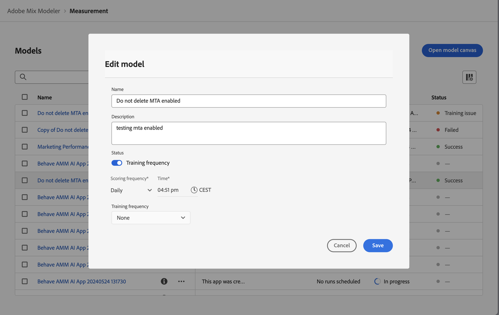

# 모델 인사이트

모델 인사이트의 각 시각화는 다음을 수행하는 데 도움이 되도록 설계되었습니다.

* 조직의 마케팅 활동이 미치는 영향을 시각화하고 수량화합니다.
* 성과가 좋은 채널을 식별합니다.
* 최적화가 필요할 수 있는 채널을 식별합니다.

이러한 통찰력은 리소스 우선 순위 지정 및 할당을 지원하는 데 도움이 됩니다.

모델 인사이트를 보려면 Mix Modeler의  **[!UICONTROL Models]** 인터페이스에서 다음을 수행합니다.

1. **[!UICONTROL Models]** 테이블에서 **[!UICONTROL Last run status]**&#x200B;이(가)  **[!UICONTROL Success]**&#x200B;인 모델 이름을 선택하십시오.

1. 컨텍스트 메뉴에서 **[!UICONTROL Model Insights]**&#x200B;을(를) 선택합니다.

다음 탭을 사용할 수 있습니다.

* [모델 인사이트](#model-insights)
* [채널 시너지](#channel-synergy)
* [요소](#factors-beta) [!BADGE 베타]
* [속성](#attribution)(MTA 사용 모델만 해당)
* [진단](#diagnostics)
* [기록 개요](#historical-overview).

각 탭의 시각화의 기반이 되는 날짜 기간을 변경할 수 있습니다. 날짜 기간을 입력하거나 을 선택하여 날짜 기간을 선택하십시오.

## 모델 표류

{{release-limited-testing-section}}

모델에서 모델 드리프트가 감지되면 나중에 또는 모델을 즉시 **[!UICONTROL Model drift detected]**&#x200B;하도록 알림을 받을 수 있는 옵션이 포함된 [**[!UICONTROL Retrain]**](overview.md#retrain) 대화 상자가 표시됩니다. **[!UICONTROL Remind me later]**&#x200B;을(를) 선택하면 다음 날 또는 다음 로그인 시 알림 메시지가 표시됩니다.

## [!UICONTROL Model insights]

모델 인사이트 탭에는 [날짜 및 기본 미디어별 기여도](#contribution-by-date-and-base-media), [채널별 기여도](#contribution-by-channel), [마케팅 성과 요약](#marketing-performance-summary) 및 [한계 응답 곡선](#marginal-response-curves)에 대한 시각화가 표시됩니다. 탭은 [접점 분류](#touchppint-breakdown) 테이블도 제공합니다.

* 각 시각화의 개별 차트 요소 위로 마우스를 가져가면 자세한 내용이 포함된 팝오버를 표시할 수 있습니다.

* 시각화에 대한 데이터가 포함된 CSV 파일을 다운로드하려면 를 선택하십시오.

* Microsoft® Excel 형식으로 전체 모델 인사이트 데이터를 다운로드하려면  **[!UICONTROL Download data]**&#x200B;를 선택하십시오.

### 날짜 및 기본 미디어별 기여도

이 스택 그래프 시각화는 다음과 같이 순서가 지정됩니다.

* 밑면이 표시됩니다.
* 비지출 채널은 중간에 표시됩니다.
* 지출 채널이 맨 위에 표시됩니다.

이 시각화는 날짜 범위에서 기본, 지출 채널 및 비지출 채널로 달성되는 기여도 비율을 나타냅니다. 이 시각화는 증분 을 표시하는 데 유용합니다. 베이스는 마케팅 없이 발생했을 일을 나타내며, 비지출 채널과 지출 채널(베이스의 상단)은 마케팅의 영향에 대한 속성입니다. 요컨대, 비지출+지출은 마케팅 노력의 증분 영향과 같으며 시각화는 마케팅이 창출하는 가치를 쉽게 파악할 수 있도록 insight을 제공합니다.

### 채널별 기여도

다양한 채널별 기여도 분포를 보여 주는 도넛 시각화입니다. 이 시각화는 상위 3개 성능 채널의 렌즈를 통해 증분(기본 및 *다른 항목*&#x200B;개 범주 제외)을 보여 줍니다. 시각화는 우선 순위 지정 및 예산 할당을 지원하는 데 도움이 됩니다.

### 마케팅 성과 요약 {#marketing-performance-summary}

>[!CONTEXTUALHELP]
>id="models_insights_undefinedchannels"
>title="정의되지 않은 채널"
>abstract="정의되지 않은 채널은 포함되지만 속성 전환은 없습니다."

각 채널별 ROI 또는 CPA 성능을 표시하는 가로 막대 그래프 시각화. 이 시각화는 마케팅 투자의 ROI/CPA를 강조 표시합니다. 채널은 ROI/CPA를 기반으로 내림차순으로 순위가 매겨집니다. 시각화는 가장 효과적인 채널과 최적화가 필요할 수 있는 채널을 식별하는 데 도움이 됩니다.

정의되지 않은 채널은 시각화에 포함되지만 속성 전환은 없습니다.

### 한계 반응 곡선

라인 차트는 마케팅 채널에 대한 투자로 생성된 한계 수익을 시각화하고 비교합니다.  현재 지출 시점과 한계 손익분기점(증분 수익이 증분 지출보다 작은 경우)을 식별합니다. 따라서 이 시각화는 마케팅 투자의 영향이 감소하기 시작하는 시기를 이해하는 데 도움이 됩니다.

커브, 현재 소비점, 한계 손익분기점 및 해당 값은 선택한 데이터 범위와 선택한 채널을 기반으로 계산됩니다.

채널을 변경하려면:

* **[!UICONTROL Channel]** 드롭다운 메뉴에서 채널을 선택하여 특정 채널에 대한 시각화를 업데이트합니다.

### 접점 분류

접점 분류 테이블에는 모든 또는 선택한 채널에 대한 주별 접점 분류가 주별 기준으로 표시되며, 각각에 연결된 주요 지표가 표시됩니다. 이 표를 통해 보다 세분화된 채널 수준에서 쉽게 비교, 트렌드 식별 및 성능 추적을 수행할 수 있습니다. 이 테이블은 날짜 및 기본 미디어별 [기여도](#contribution-by-date-and-base-media) 시각화 및 채널별 [기여도](#contribution-by-channel) 시각화를 명시적으로 보완합니다.

다음 열을 사용할 수 있습니다.

| 열 | 설명 |
|---|---|
| **[!UICONTROL Date range]** | 보고할 주입니다. |
| **[!UICONTROL Touchpoint]** | 특정 터치포인트 채널. |
| **[!UICONTROL ROI]** | (**[!UICONTROL Revenue]** - **[!UICONTROL Spend]**) / **[!UICONTROL Spend]**&#x200B;의 백분율입니다. |
| **[!UICONTROL Revenue]** | 날짜 범위에 대한 매출입니다. |
| **[!UICONTROL CPA]** | **[!UICONTROL Spend]** / **[!UICONTROL Conversions]**. |
| **[!UICONTROL Conversions]** | 날짜 범위에 대한 전환입니다. |
| **[!UICONTROL Spend]** | 데이터 범위에 대한 지출입니다. |

특정 채널 또는 모든 채널을 선택하려면 **[!UICONTROL View]** 드롭다운 메뉴에서 선택하십시오.

접점 분류 테이블의 내용을 다운로드하려면  **[!UICONTROL Download CSV]**&#x200B;을(를) 선택하십시오.

## 채널 시너지

**[!UICONTROL Channel synergy]** 탭에서 **[!UICONTROL Channel synergies]** 시각화를 사용하면 마케팅 채널이 개별 기여도를 넘어 곱셈 효과를 만들기 위해 상호 작용하는 방법을 식별할 수 있습니다.

히트맵 매트릭스는 지출 채널 쌍들 사이의 시너지 값들의 시각적 표현을 제공한다. 이 매트릭스를 통해 마케터는 채널이 상호 작용하여 성능을 향상시키는 방법을 이해할 수 있습니다. 각 모형에 대해 시너지 값을 0부터 10까지 정규화한다. 이러한 값은 *다음 달러 시너지*&#x200B;를 수량화합니다. 이는 현재 수준에서 각 채널이 1달러의 추가 지출을 받을 때 두 채널이 얼마나 효과적으로 함께 작동하는지 예상합니다.

이 차세대 프레임워크는 교육 데이터의 실제 지출 조건을 설명하므로 보다 정보에 입각한 최적화 결정을 내릴 수 있으므로 상대적 시너지 강도에 대한 현실적인 척도를 제공합니다.

매트릭스를 나타내는 CSV 파일을 다운로드하려면  **[!UICONTROL Download]**&#x200B;을(를) 선택하십시오.

>[!NOTE]
>
>기존 모델에 대해 **[!UICONTROL Channel synergy]** 탭이 표시되지 않는 경우 기능 및 시각화를 사용하도록 모델을 다시 교육하십시오.

## **[!UICONTROL Factors]** [!BADGE 베타] {#factors}

>[!CONTEXTUALHELP]
>id="models_factors_factorcontributionbreakdown"
>title="요소 기여도 분석"
>abstract="요인기여도 분류는 모형에 포함된 다양한 요인에 기인할 수 있는 기본 전환의 비율을 보여준다.  순수 기본은 모델에 포함된 마케팅 접점 및 요인과 독립적으로 발생하는 기본 전환을 나타냅니다. 여기에는 브랜드 에쿼티, 반복 구매, 유기 수요, 장기 시장 트렌드 및 계절성에 따른 전환이 포함됩니다."

요소 [!BADGE 베타] 탭에 외부 요소 관련 인사이트가 표시됩니다.

이 시각화는 다양한 내부 및 외부 요인이 전환 기준선에 미치는 증분 효과를 이해하는 데 도움이 됩니다. 예를 들어, 경제 상황 또는 홍보 활동.

**[!UICONTROL Factors]** 드롭다운 메뉴를 사용하여 표시할 요소를 선택합니다.

<!-- need to update the image when we do have a proper example -->

테이블에 대한 데이터가 포함된 CSV 파일을 다운로드하려면 를 선택합니다.

데이터를 사용할 수 없으면  **[!UICONTROL No data is available, you may need to retrain your model, or change the date range to view insights]** 메시지가 표시됩니다.

## [!UICONTROL Attribution] {#attribution}

>[!CONTEXTUALHELP]
>id="models_attribution_breakdownbychannel"
>title="채널별 분류"
>abstract="**[!UICONTROL Breakdown by channel]**&#x200B;은(는) 고객 경험 이벤트 스키마를 기반으로 정의된 접점에 대한 채널 유형별 분류입니다. 터치 포인트별 분류를 표시하려면  및 **[!UICONTROL Breakdown by touchpoint]**&#x200B;을(를) 선택하십시오."

>[!CONTEXTUALHELP]
>id="models_attribution_breakdownbytouchpointposition"
>title="접점 위치별 분류"
>abstract="이 시각화는 모든 전환 경로에서 접점 및 접점 위치별 속성 전환의 분류를 보여줍니다. 시각화는 접점이 나머지 위치와 다른 위치의 접점보다 더 나은 위치에서 기여하는지 비교합니다. 모든 접점 및 위치에서 속성 모델에 대한 백분율 기여도의 합계는 100입니다. 초보자, 인플루언서 및 피니셔의 위치는 다음과 같이 정의됩니다.<ul><li>**시작**: 접점이 전환 경로의 첫 번째 터치인지 여부를 나타냅니다.</li><li>**플레이어**: 접점이 전환으로 이어지는 첫 번째 터치와 마지막 터치 중 어느 것이 아닌지 나타냅니다.</li><li>**가까이**: 접점이 전환 전 마지막 터치인지 여부를 나타냅니다.</li></ul>"

>[!NOTE]
>
>속성 탭은 MTA 활성화 모델에만 사용할 수 있습니다.

[!UICONTROL Attribution] 탭을 사용하여 이벤트 수준 데이터가 있는 터치포인트 및 마케팅 캠페인의 효과를 이해할 수 있습니다.  [모델 빌드](build.md)를 참조하세요.

지원되는 속성 모델은 다음과 같습니다.

* Mix Modeler에서 선택한 모델 기반:
   * 알고리즘 - 영향
   * 알고리즘 - 증분
* 규칙 기반:
   * 가치 감소 단위
   * 첫 번째 터치
   * 마지막 터치
   * 선형
   * U자형

Mix Modeler의 멀티 터치 속성 기능에 대한 소개는 [멀티 터치 속성](../get-started/about.md#multi-touch-attribution)을 참조하십시오.

**[!UICONTROL Attribution Model]** 드롭다운 메뉴에서 속성 모델을 하나 이상 선택합니다. 선택한 속성 모델은 속성 탭의 모든 시각화에 적용됩니다.

Mix Modeler 멀티 터치 속성 세분화된 이벤트 점수는 전체 Mix Modeler 점수 및 ROI에 맞게 조정됩니다. 이러한 점수는 Experience Platform에서 데이터 세트로 사용할 수도 있습니다.

속성 탭은 다음 시각화로 구성됩니다.

### [!UICONTROL Overview]

[!UICONTROL Overview] 시각화는 선택한 속성 모델에 대한 전환 합계 및 백분율을 보여 줍니다. 모델을 더 선택하면 시각화에 범례에 해당하는 자체 색상이 있는 원이 더 추가됩니다.

속성 모델에 대한 세부 사항이 있는 팝업을 보려면 시각화의 원 위로 마우스를 가져갑니다.

### [!UICONTROL Trends]

[!UICONTROL Daily trends], [!UICONTROL Weekly trends] 또는 [!UICONTROL Monthly trends] 시각화는 선택한 속성 모델에 대해 일별, 주별 또는 월별 전환 트렌드를 표시합니다.

기간을 선택하려면 **[!UICONTROL Daily trends]**&#x200B;자세히&#x200B;**[!UICONTROL Weekly trends]**&#x200B;에서 **[!UICONTROL Monthly trends]**, 을(를) 선택하십시오.

세부 정보를 보려면 특정 속성 모델의 데이터 라인 위로 마우스를 가져가 해당 데이터에 대한 총 전환 수를 표시하는 팝오버를 표시합니다.

### [!UICONTROL Breakdown]

[!UICONTROL Breakdown] 시각화는 선택한 각 속성 모델에 대한 전환의 채널 또는 터치포인트별 분류입니다. 이 시각화는 각 채널 또는 터치포인트의 효과에 대한 결정을 내리는 데 도움이 될 수 있습니다.

분류 유형을 선택하려면 **[!UICONTROL Breakdown by channel]**&#x200B;자세히&#x200B;**[!UICONTROL Breakdown by touchpoint]**&#x200B;에서 을(를) 선택하십시오.

세부 정보를 보려면 차트 요소 위로 마우스를 가져갑니다.

### [!UICONTROL Top campaigns]

상위 캠페인 시각화는 캠페인 이름, 채널, 미디어 유형 및 증분 전환에 대한 열이 있는 상위 캠페인의 테이블을 표시합니다. 이 시각화는 주어진 채널에 대한 특정 캠페인의 효과를 팀에 알리고 추가로 투자해야 하는 캠페인에 대한 통찰력을 제공하는 데 도움이 될 수 있습니다.

채널, 미디어 유형 또↑ 증분 전환에 ↓ 오름차순 또는 내림차순으로 테이블을 정렬하려면 열 헤더를 선택하고 정렬을 토글합니다.

별도의 대화 상자에서 테이블을 확장하려면 **[!UICONTROL Expand]**&#x200B;자세히을(를) 선택합니다.

확장된 [상위 캠페인] 대화 상자에는 다음과 같은 추가 열이 있는 동일한 테이블이 표시됩니다.

* 증분 전환
* 영향을 받은 전환
* 첫 번째 터치 전환
* 마지막 터치 전환

  추가 열 헤더를 각각 선택하여 테이블을 오름차순 또는 내림차순으로 정렬할 수 있습니다.

확장된 [최상위 캠페인] 대화 상자를 닫으려면 **[!UICONTROL Close]**&#x200B;을(를) 선택합니다.

### [!UICONTROL Breakdown by touchpoint position]

[!UICONTROL Breakdown by touchpoint position] 시각화는 모든 전환 경로에서 접점 및 접점 위치별 속성 전환의 분류입니다. 이 차트는 터치포인트가 나머지 위치와 다른 위치보다 한 위치에서 더 잘 기여하는지 비교하는 데 도움이 됩니다.

>[!NOTE]
>
>모든 접점 및 위치에서 속성 모델에 대한 백분율 기여도의 합계는 100이어야 합니다.

위치 [!UICONTROL Starter], [!UICONTROL Player] 및 [!UICONTROL Closer]은(는) 다음과 같이 정의됩니다.

| 위치 | 설명 |
|---|---|
| [!UICONTROL Starter] | 이 위치는 접점이 전환 경로의 첫 번째 터치인지 여부를 나타냅니다. |
| [!UICONTROL Player] | 이 위치는 접점이 전환으로 이어지는 첫 번째 터치인지 마지막 터치인지 여부를 나타냅니다. |
| [!UICONTROL Closer] | 이 위치는 접점이 전환 전 마지막 터치인지 여부를 나타냅니다. |

### [!UICONTROL Top conversion paths]

[!UICONTROL Top conversion paths] 시각화는 선택한 속성 모델을 기반으로 상위 5개의 전환 경로를 표시합니다.

각 전환 경로에 대해 다음을 확인합니다.

* 영향을 미치는 채널의 수,
* 총 속성 경로,
* 이 전환 경로에 대한 속성 경로와 총 속성 경로의 백분율,
* 각 채널에 대해 속성 모델 기여도 백분율 및
* 이러한 채널 속성 모델 기여도의 합계입니다.

## [!UICONTROL Diagnostics] {#diagnostics}

>[!CONTEXTUALHELP]
>id="models_diagnostics_modelassessment"
>title="모델 평가 그래프"
>abstract="모델 평가 시각화는 실제 전환과 예측 전환 또는 잔여 전환을 분석합니다."
>additional-url="https://experienceleague.adobe.com/ko/docs/mix-modeler/using/overview" text="Mix Modeler 개요"
>additional-url="https://video.tv.adobe.com/v/3440801/?captions=kor&learn=on&enablevpops" text="Mix Modeler 데모"

>[!CONTEXTUALHELP]
>id="models_diagnostics_modeltrainingfitmetrics"
>title="모델 맞춤 지표"
>abstract="여러 모델 교육 적합도 지표에 대한 개요를 표시합니다."

>[!CONTEXTUALHELP]
>id="models_diagnostics_pathstouched"
>title="터치된 경로"
>abstract="터치된 경로는 각 접점에서 전환을 달성한 경로의 백분율과 전환을 달성하지 못한 경로의 백분율입니다."

>[!CONTEXTUALHELP]
>id="models_diagnostics_efficiencymeasure"
>title="효율성 측정"
>abstract="알고리즘 속성 모델에 의해 생성된 효율성 측정은 접점 볼륨에 관계없이 전환에 대한 접점의 상대적 중요성을 나타냅니다. 이것은 1에서 5까지의 척도로 측정됩니다. 더 높은 접점 볼륨이 더 높은 효율성 측정을 보장하지는 않습니다."

>[!CONTEXTUALHELP]
>id="models_diagnostics_totalvolume"
>title="총 볼륨"
>abstract="총 볼륨은 접점이 사용자에 의해 터치된 총 횟수이며 전환을 수행하는 경로와 전환을 수행하지 않는 경로에 나타나는 접점을 포함합니다."

>[!CONTEXTUALHELP]
>id="models_diagnostics_modeldateinfo"
>title="모델 날짜 기준"
>abstract="이 테이블의 데이터는 특정 기간 동안만 생성됩니다.  **[!UICONTROL As of]** 날짜는 데이터가 생성된 시간을 나타내며 startDate부터 endDate까지의 데이터를 기반으로 합니다."

**[!UICONTROL Diagnostics]** 탭에는 다음에 대한 시각화가 표시됩니다.

* 다음으로 구성된 **[!UICONTROL Model Assessment]** 시각화:

  

   * 실제 변환과 예측 또는 잔차 변환을 분류할 수 있는 그래프입니다.
시각화를 분류하려면 **[!UICONTROL Breakdown]** 목록에서 다음 옵션 중 하나를 선택하십시오.

      * **[!UICONTROL Actual vs Predicted]**: 이 옵션은 실제 값을 모델 예측과 비교합니다. 이상적으로, 예측된 값은 실제 값과 밀접하게 정렬되어야 하지만, 약간의 편차가 예상된다. 큰 또는 체계적인 편차 또는 패턴은 누락된 관계 및 데이터 또는 잠재적인 편향을 나타낼 수 있다.

      * **[!UICONTROL Residuals]**: 이 옵션은 실제 값과 예측된 값의 차이를 표시합니다. 성과가 좋은 모델은 명확한 패턴이나 스프레드의 증가 없이 무작위로 분포된 잔차를 갖는다. 구조화된 트렌드 또는 확장 잔차는 누락된 관계 및 데이터 또는 분산 문제를 나타낼 수 있습니다.

   * 각 전환 지표에 대한 다음 열을 보여주는 표

      * **[!UICONTROL Actual Conversion]**
      * **[!UICONTROL Predicted Conversion]**
      * **[!UICONTROL Residual Conversion]**
      * **[!UICONTROL R2]**, 데이터가 회귀 모델(적합도)에 얼마나 잘 맞는지 알려주는 점수입니다.
      * **[!UICONTROL MAPE]**(평균 절대 백분율 오류): 예측 정확도를 측정하기 위해 가장 일반적으로 사용되는 KPI 중 하나이며 예측 오류를 실제 값의 백분율로 표시합니다.
      * **[!UICONTROL RMSE]**(제곱 평균 제곱근 오류): 평균 오류를 나타내며 오류의 제곱에 따라 가중치가 적용됩니다.

  테이블에 대한 데이터가 포함된 CSV 파일을 다운로드하려면 를 선택합니다.

* 각 전환 지표에 대해 표시되는 **[!UICONTROL Model training fit metrics]** 테이블:

  

   * **[!UICONTROL Training R2]**: 모델의 예측으로 설명한 실제 값의 분산 비율을 나타냅니다(0 ~ 1 범위).
   * **[!UICONTROL Training sMAPE]**(대칭 평균 절대 백분율 오류): 교육 데이터에 대한 평균 백분율 오류를 측정합니다. 값이 낮을수록 정확도가 향상됩니다.
   * **[!UICONTROL Training RMSE]**(제곱 평균 제곱근 오류): 교육 데이터에 대한 평균 백분율 오류를 측정합니다. MAPE보다 더 큰 오류를 처벌합니다. 낮은 RMSE는 더 나은 예측 정확도를 시사하지만 이상치에 민감하다.
   * **[!UICONTROL Out-of-sample sMAPE]**: 확인되지 않은 데이터에 대해 백분율 오류를 평가하여 초과 및 미만 예측의 균형을 조정합니다. 일반화를 평가하는 데 도움이 됩니다. 현재 Mix Modeler은 교육 데이터의 마지막 분기를 보류 집합으로 사용하여 백분율 오류를 평가합니다.
   * **[!UICONTROL Out-of-sample RMSE]**: 확인되지 않은 데이터에 대해 백분율 오류를 평가하여 초과 및 미만 예측의 균형을 조정합니다. 일반화를 평가하는 데 도움이 됩니다. 현재 Mix Modeler은 교육 데이터의 마지막 분기를 보류 집합으로 사용하여 백분율 오류를 평가합니다. RMSE는 MAPE보다 더 큰 오류를 처벌합니다.

* 기여도 AI 알고리즘 모델의 결과를 나타내는 **[!UICONTROL Touchpoint effectiveness]** 테이블입니다.

  

  이 테이블의 데이터는 특정 기간 동안만 생성됩니다. 자세한 내용은 **[!UICONTROL As of *xx/xx/xx, xx:xx TZ *]**를 선택하십시오.

  시각화는 각 터치포인트에 대해 내림차순 [!UICONTROL Efficiency measure] 으로 표시됩니다.

   * **[!UICONTROL Paths touched]**: 전환된 경로의 비율과 전환되지 않은 경로의 비율을 시각화합니다. 접점의 경우 속성 전환율이 높으면 더 많은 속성 전환을 볼 수 있습니다. 이 비율은 전환으로 이어지는 경로의 비율과 전환으로 이어지는 *아닌*&#x200B;경로의 비율을 비교합니다.
   * **[!UICONTROL Efficiency measure]**: 알고리즘 속성 모델에 의해 생성된 효율성 측정은 접점 볼륨에 관계없이 전환에 대한 접점의 상대적 중요성을 나타냅니다. 효율은 1~5의 척도로 측정됩니다. 더 높은 접점 볼륨이 더 높은 효율성 측정을 보장하지는 않습니다.
   * **[!UICONTROL Total volume]**: 사용자가 터치포인트를 터치한 총 횟수입니다. 이 숫자는 전환을 수행하는 경로와 전환을 수행하는 경로 *not*&#x200B;에 표시되는 터치포인트를 포함합니다.

### 모델 드리프트 감지

>[!AVAILABILITY]
>
>이 섹션에 설명된 기능은 릴리스의 제한된 테스트 단계에 있으며, 사용자 환경에서 아직 사용하지 못할 수 있습니다. 이 메모는 기능을 일반적으로 사용할 수 있는 경우 제거됩니다. Mix Modeler 릴리스 프로세스에 대한 정보는 [Mix Modeler 기능 릴리스](/help/releases/latest.md)를 참조하십시오.
>

모델 드리프트가 감지되면 맨 위에 **[!UICONTROL Model drift detected]** 알림이 표시됩니다.

알림을 숨기려면 **[!UICONTROL Hide]**&#x200B;을(를) 선택하십시오. 알림은 다음 날 또는 다음 로그인 시 다시 나타납니다.

## [!UICONTROL Historical overview]

내역 개요 탭에는 다음에 대한 시각화가 표시됩니다.

### 회계 분기 및 제품별 전환 및 지출

이 시각화는 지정된 날짜 범위 내의 다양한 분기에 걸친 전환 및 지출 분포를 나타냅니다. 시각화는 지출이 전환을 유도하는 성과가 좋은 분기를 식별하는 데 도움이 됩니다.

### 채널별 소비

이 시각화는 지정된 날짜 범위 내의 다양한 채널에 걸친 지출 분포를 나타냅니다. 시각화는 가장 많은 비용을 받는 채널을 빠르게 식별할 수 있도록 지원합니다.

### 접점 사용

이 시각화는 지정된 날짜 범위 내의 각 분기에 대해 유료 터치포인트에 대한 지출 분포를 나타냅니다. 시각화를 통해 특정 채널 및 분기 내에서 우선 순위가 지정된 터치포인트를 이해할 수 있습니다. 시각화는 채널 지출 패턴 및 트렌드, 특히 시간이 지남에 따라 지출이 적고 빈번하지 않은 채널을 식별하는 데 도움이 됩니다.

이 시각화에 대해 표시할 대체 비용 기반 채널을 선택하려면 다음을 수행하십시오.

* **[!UICONTROL Channels]**&#x200B;에서 채널을 선택하십시오.

### 접점 볼륨

이 시각화는 지정된 날짜 범위 내의 각 분기에 대한 모든 접점에 대한 볼륨 분포를 나타냅니다.

이 시각화에 대해 표시할 대체 볼륨 기반 채널을 선택하려면 다음을 수행하십시오.

* **[!UICONTROL Channels]**&#x200B;에서 채널을 선택하십시오.

## **[!UICONTROL Edit]**

모델의 이름, 설명 및 교육 및 채점 일정을 편집할 수 있습니다.

1.  편집 선택

1. **[!UICONTROL Edit model]** 대화 상자에서:

   * 새 **[!UICONTROL Name]** 및 **[!UICONTROL Description]**&#x200B;을(를) 입력하십시오.

   * 예약을 사용하려면 **[!UICONTROL Status]**&#x200B;을(를) 사용하도록 설정하십시오. 교육되고 점수가 매겨진 모델만 예약할 수 있습니다.

      1. **[!UICONTROL Scoring frequency]** 선택:

         * **[!UICONTROL Daily]**: 올바른 시간(예: `05:22 pm`)을 입력하거나 를 사용하십시오.
         * **[!UICONTROL Weekly]**: 요일을 선택하고 올바른 시간(예: `05:22 pm`)을 입력하거나 를 사용하십시오.
         * **[!UICONTROL Monthly]**: 모든 드롭다운 메뉴에서 요일을 선택하고 올바른 시간(예: `05:22 pm`)을 입력하거나 를 사용하십시오.

      1. 드롭다운 메뉴에서 **[!UICONTROL Training frequency]**&#x200B;을(를) 선택합니다. **[!UICONTROL Monthly]**, **[!UICONTROL Quarterly]**, **[!UICONTROL Yearly]** 또는 **[!UICONTROL None]**.

     

1. **[!UICONTROL Save]**&#x200B;를 선택합니다.
