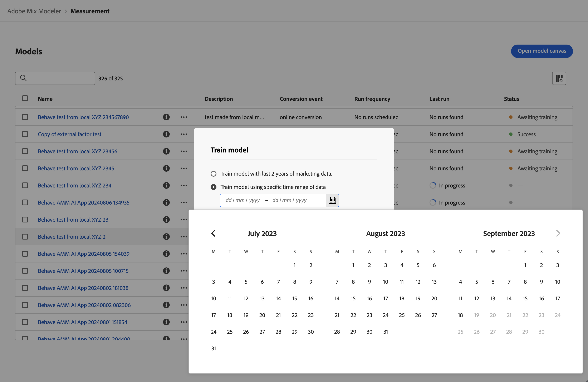

# 교육 및 점수 모델

모델을 [구축](/help/models/build.md)하면 모델이 자동으로 학습되고 점수가 매겨집니다. 모델을 수동으로 재교육하거나 재교육할 수 있습니다.

## 교육

새로운 증분 마케팅 및 요소 데이터를 포함하려는 경우 모델을 다시 교육하는 것이 좋습니다. 예를 들어 지난 분기 동안 시장 동향이 변경되었거나 마케팅 데이터 배포가 크게 변경되었습니다.

모델을 재교육하려면

1. 왼쪽 레일에서  **[!UICONTROL Models]**&#x200B;을(를) 선택합니다.

1. 모델에 대해 를 선택하고 상황에 맞는 메뉴에서 **[!UICONTROL Train]**&#x200B;을(를) 선택합니다. 또는 파란색 작업 표시줄에서  **[!UICONTROL Train]**&#x200B;을(를) 선택하십시오.

   **[!UICONTROL Train model]** 대화 상자에서 다음 옵션을 선택합니다.

   * **[!UICONTROL Train model with last 2 years of marketing data]** 또는
   * **[!UICONTROL Train model using specific date range of data]**.
날짜 범위를 지정합니다. 을 사용하여 날짜 범위를 선택할 수 있습니다. 최소 1년의 데이터 범위를 선택해야 합니다.

   

1. 모델을 다시 교육하려면 **[!UICONTROL Train]**&#x200B;을(를) 선택하십시오.

모델이 성공적으로 교육된 경우에만 모델을 다시 교육할 수 있습니다.

## 점수

새 마케팅 데이터를 기반으로 모델에 증분 점수를 매기거나 특정 날짜 범위에 대한 모델을 다시 정렬할 수 있습니다.

모델을 재정의하는 것을 고려하십시오.

* 잘못된 마케팅 데이터를 수정하십시오. 예를 들어 모델의 교육 및 점수에 포함한 최근 유료 검색 데이터에서 1주일 간의 데이터를 누락했습니다.
* 통합 데이터의 일부로 구성한 데이터 세트에서 업데이트를 통해 사용할 수 있게 된 새로운 증분 마케팅 데이터를 사용합니다.

모델에 점수를 매기거나 다시 매기려면 다음을 수행합니다.

1. 왼쪽 레일에서  **[!UICONTROL Models]**&#x200B;을(를) 선택합니다.

1. 모델에 대해 를 선택하고 상황에 맞는 메뉴에서 **[!UICONTROL Score]**&#x200B;을(를) 선택합니다. 또는 파란색 작업 표시줄에서  **[!UICONTROL Score]**&#x200B;을(를) 선택하십시오.

   **[!UICONTROL Score marketing data]** 대화 상자에서 다음 옵션을 선택합니다.

   * **[!UICONTROL Score new marketing data from *mm/dd/yyyy *]**, 새 마케팅 데이터를 사용하여 점진적으로 모델에 점수를 매기거나
   * **[!UICONTROL Score specific date range of marketing data]**을(를) 사용하여 특정 날짜 범위를 다시 검색하십시오.
날짜 범위를 지정합니다. 을 사용하여 날짜 범위를 선택할 수 있습니다.

   

1. **[!UICONTROL Score]**&#x200B;을(를) 선택합니다. 특정 데이터 범위를 사용하여 모델의 점수를 다시 매길 때 **[!UICONTROL Existing model is replaced]** 대화 상자가 표시되어 선택한 날짜 범위에 대해 모델을 새 점수로 바꾸도록 확인하는 메시지가 표시됩니다. **[!UICONTROL Replace model]**&#x200B;을(를) 선택하여 확인하십시오.

>[!IMPORTANT]
>
>모델 재정의는 재계산된 모델을 기반으로 이미 생성된 플랜을 변경하지 않습니다. 계획에서 새 복원 모델을 사용하려면 새 계획을 생성해야 합니다.

