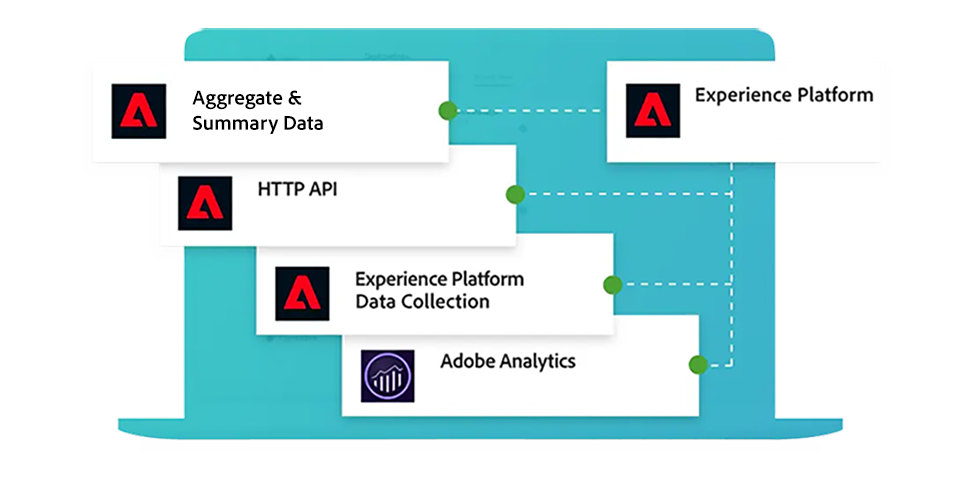

# Adobe Mix Modeler 안내서

이 기술 설명서 가이드는 **Mix Modeler** Adobe에 대한 자가 진단 지원을 제공합니다. Mix Modeler은 캠페인을 측정하고 유료, 수익 및 소유 등 모든 채널에서 전체적으로 계획을 최적화하는 Adobe Experience Cloud 애플리케이션입니다. Mix Modeler은 Adobe Experience Platform의 맨 위에 구축되었으며 Adobe Sensei에서 지원합니다.

## 기본 사항부터 시작

<table style="table-layout:fixed">
  <tr style="border: 0;">
    <td>
    
    
<strong>빠른 시작</strong> Mix Modeler 워크플로에 대한 개요와 통찰력을 얻으십시오.

    </td>
    <td>
    
    
<strong>데이터 수집</strong> Mix Modeler에 이벤트 및 집계 또는 요약 데이터를 수집하는 방법에 대해 알아봅니다.

    </td>
    <td>
    
    
<strong>데이터 통합</strong> 집계 및 이벤트 데이터를 일관된 데이터 보기에 통합하는 방법을 알아봅니다. 
    

    </td>
    <td>
    
    
<strong>모델 및 계획</strong> 모델을 교육하고 평가하여 마케팅 계획에 대한 인사이트를 사용합니다.

    </td>
  </tr>
  <tr style="border: 0;">
    <td align="center"></td>
    <td align="center"></td>
    <td align="center"></td>
    <td align="center"></td>
    </tr>
</table>

## 설명서 살펴보기

<table style="table-layout:fixed">
  <tr style="border: 0;">
    <td>
       
      <strong>데이터 수집</strong> <a href="/help/ingest-data/overview.md">개요</a> - <a href="/help/ingest-data/schemas.md">스키마</a> - <a href="/help/ingest-data/datasets.md">데이터 세트</a> 
    </td>
    <td>
       
      <strong>데이터 통합</strong> <a href="/help/harmonize-data/overview.md">개요</a> - <a href="/help/harmonize-data/fields.md">필드</a> - <a href="/help/harmonize-data/dataset-rules.md">데이터 세트 규칙</a> - <a href="/help/harmonize-data/marketing-touchpoints.md">마케팅 접점</a> - <a href="/help/harmonize-data/conversions.md">전환</a> - <a href="/help/harmonize-data/usage-report.md">사용 보고서</a>  
    </td>
    <td>
       
      <strong>모델</strong> <a href="/help/models/overview.md">개요</a> - <a href="/help/models/build.md">모델 구축</a> - <a href="/help/models/insights.md">모델 인사이트</a> - <a href="/help/models/scoring-data.md">채점 데이터 사용</a>
    </td>
  </tr>
  <tr style="border: 0;">
    <td>
       
      <strong>계획</strong> <a href="/help/plans/overview.md">계획</a> - <a href="/help/plans/build.md">계획 작성</a> - <a href="/help/plans/compare.md">계획 비교</a> - <a href="/help/plans/build.md">계획 통찰력</a>
    </td>
    <td>
       
      <strong>개요</strong> <a href="/help/dashboard/overview.md">스키마</a> - <a href="/help/dashboard/harmonized-data.md">통합 데이터</a> - <a href="/help/dashboard/plans.md">계획</a>
    </td>
        <td>
       
      <strong>Tutorials</strong> <a href="https://experienceleague.adobe.com/docs/mix-modeler-learn/tutorials/overview.html?lang=en">개요</a> - <a href="https://experienceleague.adobe.com/docs/mix-modeler-learn/tutorials/intro/use-cases.html?lang=en">사용 사례</a> - <a href="https://experienceleague.adobe.com/docs/mix-modeler-learn/tutorials/intro/user-workflow.html?lang=en">사용자 워크플로우</a> - <a href="https://experienceleague.adobe.com/docs/mix-modeler-learn/tutorials/intro/user-interface-tour.html?lang=en">사용자 인터페이스 둘러보기</a>
    </td>
  </tr>
</table>
