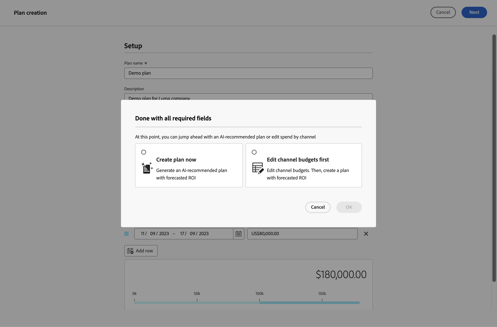
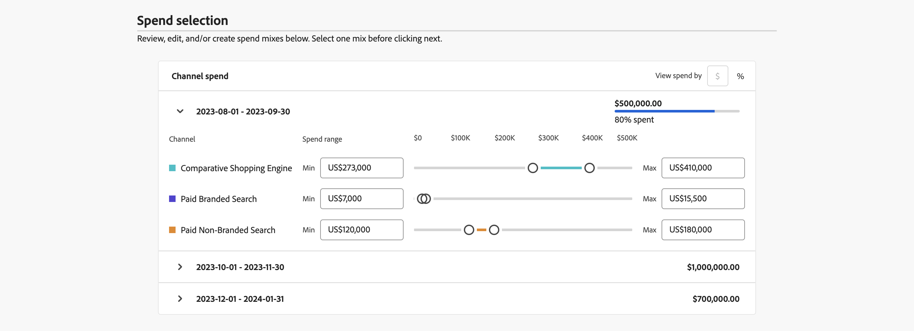

# 계획 만들기

Mix Modeler에서 계획 캔버스를 사용하여 계획을 생성합니다. 계획 캔버스에서 계획에 사용할 기본 모델과 계획의 세부 정보와 예산을 설정할 수 있습니다. 세부 정보, 예산 및 모델을 지정하면 AI 추천 플랜을 진행하거나 채널별 지출을 편집할 수 있습니다.

계획을 생성하려면  **[!UICONTROL Plans]** Mix Modeler에서 인터페이스, 선택 **[!UICONTROL Open plan canvas]**.

1. 계획 생성 화면에서 다음을 수행합니다.

   1. 다음에서 **[!UICONTROL Setup]** 섹션

      1. 입력 **[!UICONTROL Plan name]**, 예 `Demo plan`. 입력 **[!UICONTROL Description]**, 예 `Demo plan for Luma company`.
      1. 선택 **[!UICONTROL Model]** 출처: **[!UICONTROL _옵션 선택.._.]**.
      1. 다음을 선택할 수 있습니다.  **[!UICONTROL Create model]** 를 사용하여 계획 생성 내에서 직접 모델을 생성할 수 있습니다. 그러면 브라우저에서 새 탭이 열리고 [모델](../models/overview.md) 인터페이스.

         

   1. 다음에서 **[!UICONTROL Budget]** 섹션:

      1. 날짜를 입력하거나 다음을 사용하여 날짜 범위를 선택하여 날짜 범위를 지정하십시오. .
      1. 예산을 입력합니다.

      예산을 각각 사용하여 날짜 범위를 추가하려면 다음을 선택합니다.  **[!UICONTROL Add row]**.

      일자 범위 및 관련 예산을 삭제하려면 .

      지정된 최대 예산을 정의하려면

      1. 전환 **[!UICONTROL Maximize budget]** 켜짐.
      1. 최대 예산 금액을 지정합니다. 금액은 날짜 범위에 대해 지정된 총 예산 금액보다 크거나 같아야 합니다.

         

   1. **[!UICONTROL Next]**&#x200B;를 선택합니다.

1. 다음에서 **[!UICONTROL Done with all required fields]** 대화 상자:

   

   * 선택  **[!UICONTROL Create plan now]** roi가 예측된 AI 추천 플랜을 생성하려는 경우.

     선택 **[!UICONTROL OK]**. 플랜이 생성되었습니다.

   * 선택  **[!UICONTROL Edit channel budgets first]** 예상 ROI로 계획을 세우기 전에 채널 예산을 편집하려는 경우.

     선택 **[!UICONTROL OK]**&#x200B;에서 채널 지출을 정의할 수 있습니다 **[!UICONTROL Spend selection]** 을 누릅니다.

1. 다음에서 **[!UICONTROL Spend selection]** 섹션, 각 예산 일자 범위에 대해  top 해당 데이터 범위에 대한 채널 배포 보기를 엽니다.

   1. 각 채널에 대한 예산을 정의하려면 값을 입력합니다. **[!UICONTROL Min]** 및 **[!UICONTROL Max]** 또는 슬라이더를 사용하십시오.

   1. 통화 또는 백분율 입력 간을 전환하려면 다음을 선택합니다 **[!UICONTROL $]** 또는 **[!UICONTROL %]** 대상 **[!UICONTROL View spend by]**.

      

   1. 완료되면 다음을 선택합니다. **[!UICONTROL Create]**.

   1. 다음에서 **[!UICONTROL Create plan]** 대화 상자, 선택 **[!UICONTROL Create plan]** 을 클릭하여 플랜을 만듭니다. 선택 **[!UICONTROL Cancel]** 플랜 만들기를 취소합니다. A **[!UICONTROL No work is saved]** 확인할 수 있는 대화 상자가 표시됩니다.
