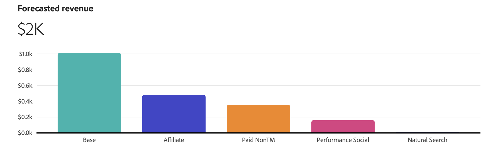

# 플랜 인사이트

[!UICONTROL Plan insights]에서 플랜의 기반이 되는 [!UICONTROL Model], [!UICONTROL Data range] 및 [!UICONTROL Plan target]을(를) 표시하는 플랜 인사이트가 만들어집니다.

인사이트가 만들어지면 다음으로 구성된 플랜 개요가 표시됩니다.

- 플랜의 기반이 되는 [!UICONTROL Model], [!UICONTROL Data range] 및 [!UICONTROL Plan target]을(를) 표시하는 헤더입니다.
   - 목표 기반 계획을 정의한 경우 배지가 목표 상태를 나타냅니다. 가능한 옵션은 다음과 같습니다.

      - [!BADGE 달성 가능한 목표]{type=Positive}
      - [!BADGE 목표를 달성할 수 없음]{type=Negative}

   - 자세한 내용을 표시하려면  **[!UICONTROL Show more]**&#x200B;을(를) 선택하십시오.

- [[!UICONTROL Forecasted paid channel ROI] 시각화](#forecasted-paid-channel-spend-and-roi)
- [[!UICONTROL Forecasted revenue] 시각화](#forecasted-revenue)
- [[!UICONTROL Forecasted conversion] 시각화](#forecasted-conversions)
- [[!UICONTROL Marginal channel return] 시각화](#marginal-channel-return)
- [[!UICONTROL Data range breakdown] 테이블(](#date-range-breakdown) 계획의 테이블, 열 표시)

   - 채널
   - ROI
   - CPA
   - 매출
   - 전환 목표
   - 지출

인터페이스를 닫으려면 **[!UICONTROL Close]**&#x200B;을(를) 선택합니다.

플랜의 ROI를 보는 방법을 변경하려면 **[!UICONTROL X]** 또는 **[!UICONTROL &#x200B; %]**(**[!UICONTROL View ROI]**)을(를) 선택하십시오.

## 유료 채널 지출 및 ROI 예측

이 시각화는 모델, 날짜 범위 및 예산을 기반으로 유료 채널의 예상 지출 및 투자 수익률에 대한 산포도를 표시합니다.

## 예상 수익

이 막대 차트 시각화는 모델, 날짜 범위 및 예산을 기반으로 채널에 대해 예측된 매출을 보여줍니다.

## 예측 전환

이 막대 차트 시각화는 모델, 날짜 범위 및 예산을 기반으로 채널에 대해 예측된 전환을 보여줍니다.

## 한계 채널 수익

이 선 차트 시각화는 **[!UICONTROL Marginal break-even]** 및 **[!UICONTROL Return point]**&#x200B;에 대한 지표가 있는 선택한 채널에 대한 한계 수익률 곡선을 보여 줍니다. 이 시각화는 채널 경비가 한계 손익분기점에 도달하는 방법을 이해하는 데 도움이 됩니다. 또한 채널 지출을 증가시킬 공간이 있는지 또는 채널 지출 효율성을 개선하기 위해 채널에 더 적은 비용을 지출해야 하는지 여부.

시각화에 사용할 특정 채널을 선택하려면 **[!UICONTROL View]** 드롭다운 메뉴에서 채널을 선택합니다.

## 날짜 범위 분류

[!UICONTROL Date range breakdown] 테이블은 [!UICONTROL ROI], [!UICONTROL Revenue], [!UICONTROL CPA], [!UICONTROL Conversions] 및 [!UICONTROL Spend]에 대한 채널별 세부 데이터를 보여줍니다.

1. 날짜 범위 분류의 데이터가 포함된 CSV 파일을 다운로드하려면  **[!UICONTROL Download CSV]**&#x200B;을(를) 선택하십시오. 컨텍스트 메뉴에서:

   - CSV 형식의 자세한 데이터를 보려면  **[!UICONTROL Detailed CSV]**&#x200B;을(를) 선택하십시오.
   - CSV 형식의 요약 데이터를 보려면  **[!UICONTROL Summary CSV]**&#x200B;을(를) 선택하십시오.

   세부 데이터는 주별로 입력된 세부 데이터입니다. 요약 데이터는 모델이 제공한 날짜 범위에 의해 입력된 데이터입니다.

1. 채널의 범주별 날짜 범위 분류를 보려면 **[!UICONTROL View]** 선택에서 **[!UICONTROL All channels]**, **[!UICONTROL Paid channels]** 또는 **[!UICONTROL Non-paid channels]**&#x200B;을(를) 선택하십시오.

## 플랜 편집

플랜을 편집하려면  **[!UICONTROL Edit plan]**&#x200B;을(를) 선택하십시오.

1. **[!UICONTROL Spend selection]** 섹션에서 각 예산 날짜 범위에 대해 를 사용하여 해당 데이터 범위에 대한 채널 배포 보기를 엽니다.

   과거 마케팅 지출 데이터와 통찰력을 사용하려는 경우 내역 참조 데이터를 사용할 수 있습니다. 내역 참조 데이터를 고려하십시오.

   - 성과가 좋은 채널과 성과가 나쁜 채널을 강조 표시하여 예산 할당을 개선합니다.
   - 지원 트렌드 분석.
   - 효과적인 전략을 식별하고 계획을 구성하는 동안 실수를 방지합니다.

   과거 참조 기간을 선택하는 경우 이전 지출 패턴 환경 설정에 맞게 조정하며 Mix Modeler의 계획 기능을 사용하면 예상 범위 내의 계획을 생성할 수 있습니다. 이러한 플랜은 궁극적으로 관련자의 신뢰를 강화하고, 마케팅 플랜이 전략적이고 효율적이며, 이러한 플랜이 입증된 성과 데이터 및 비즈니스 요구에 기반을 두도록 해야 합니다.

   

   1. **[!UICONTROL Spend pattern]**&#x200B;을(를) 선택합니다.

      - 기본 옵션은 **[!UICONTROL Automatic]**&#x200B;입니다.
      - Mix Modeler에서 이미 사용 가능한 과거 마케팅 지출 데이터를 참조하려면 **[!UICONTROL Historical reference]**&#x200B;을(를) 선택하고 **[!UICONTROL Start date]**&#x200B;을(를) 입력하십시오. **[!UICONTROL End date]**&#x200B;은(는) 선택한 데이터 범위를 기반으로 자동으로 결정됩니다. 제안된 시작 날짜는 사용 가능한 첫 번째 사용 가능한 과거 마케팅 지출 데이터입니다. 존재하지 않는 기록 참조 기간을 선택했음을 나타내려면 가 표시됩니다.

   1. 각 채널의 예산을 수정하려면 **[!UICONTROL Min]** 및 **[!UICONTROL Max]**&#x200B;의 값을 수정하거나 슬라이더를 사용하십시오.

   1. 통화 또는 백분율 입력 간을 전환하려면 **[!UICONTROL View spend by]**&#x200B;에 대해 **[!UICONTROL $]** 또는 **[!UICONTROL %]**&#x200B;을(를) 선택하세요.

   1. 플랜 세부 정보를 편집하려면 **[!UICONTROL Edit details]**&#x200B;을(를) 선택하세요.

      1. **[!UICONTROL Setup]** 섹션에서:

         1. **[!UICONTROL Plan name]**(예: `Demo plan`)을(를) 입력하십시오. **[!UICONTROL Description]**(예: `Demo plan for Luma company`)을(를) 입력하십시오.
         1. **[!UICONTROL _에서&#x200B;**&#x200B;[!UICONTROL Model]&#x200B;**을(를) 선택하십시오. 옵션을 선택하십시오._.]**

            

      1. **[!UICONTROL Goal]** 섹션에서 계획을 최적화할 목표를 선택합니다. 다음 중 하나를 선택할 수 있습니다.
         - **[!UICONTROL I have a budget to spend]**

           

           이 옵션을 사용하면 하나 이상의 날짜 범위에 대한 예산을 입력할 수 있습니다.

            1. **[!UICONTROL Optimize]** 컨테이너에서:
               1. **[!UICONTROL Select conversion]** 드롭다운 메뉴에서 전환을 선택합니다.
               1. **[!UICONTROL Select model]** 드롭다운 메뉴에서 모델을 선택합니다.
            1. 날짜를 입력하거나 을 사용하여 날짜 범위를 선택하여 **[!UICONTROL Date range]**&#x200B;을(를) 지정하십시오.
            1. **[!UICONTROL Budget]** 입력.
각각 예산이 있는 날짜 범위를 추가하려면  **[!UICONTROL Add row]**&#x200B;을(를) 선택하십시오.
날짜 범위 및 관련 예산을 삭제하려면 를 선택하세요.
            1. 계획을 제한하려는 선택적 최대 예산을 정의하려면
               1. **[!UICONTROL Maximize budget]** 스위치를 켭니다.
               1. 최대 예산 금액을 지정합니다. 금액은 날짜 범위에 대해 지정된 예산의 총 금액보다 크거나 같아야 합니다.

         - **[!UICONTROL I have a target to achieve]** [!BADGE Beta]

           

            1. **[!UICONTROL Optimize]** 컨테이너에서
               1. **[!UICONTROL Select conversion]** 드롭다운 메뉴에서 전환을 선택합니다.
               1. **[!UICONTROL Select target metric]** 드롭다운 메뉴에서 대상 지표를 선택합니다. **[!UICONTROL Conversion]**, **[!UICONTROL CPA]**, **[!UICONTROL Revenue]** 또는 **[!UICONTROL ROI]** 중에서 선택할 수 있습니다.
               1. **[!UICONTROL Select model]** 드롭다운 메뉴에서 모델을 선택합니다.
            1. 날짜를 입력하거나 을 사용하여 날짜 범위를 선택하여 날짜 범위를 지정하십시오.
            1. 선택한 대상 지표에 대한 값을 입력합니다. 예를 들어, **[!UICONTROL Conversion]**&#x200B;의 숫자, **[!UICONTROL ROI]**&#x200B;의 백분율 또는 **[!UICONTROL CPA]** 및 **[!UICONTROL Revenue]**&#x200B;의 통화 값입니다.
대상 지표가 있는 날짜 범위를 추가하려면  **[!UICONTROL Add row]**&#x200B;을(를) 선택하십시오.
날짜 범위 및 연결된 대상 지표를 삭제하려면 를 선택하세요.
            1. 계획을 제한하려는 선택적 최대 예산을 정의하려면
               1. **[!UICONTROL Maximize budget]** 스위치를 켭니다.
               1. 최대 예산 금액을 지정합니다.

         1. **[!UICONTROL Spend selection]** 섹션으로 돌아가려면 **[!UICONTROL Next]**&#x200B;을(를) 선택하십시오.

1. **[!UICONTROL Advanced configuration]** 섹션에서:

   

   - 계획명 , 모델, 날짜 범위 및 총 예산이 요약됩니다.

   - 기본적으로 Mix Modeler은 최신 이전 시즌 데이터를 사용하여 전환당 평균 매출을 자동으로 계산합니다. **[!UICONTROL Average Revenue per conversion]**&#x200B;에서 전환당 특정 평균 매출을 정의할 수 있습니다.

   1. 예산의 각 일자 범위에 대해
      1. **[!UICONTROL Date range]** 드롭다운 메뉴에서 날짜 범위를 선택합니다.
      1. **[!UICONTROL Average revenue]** 값을 입력하십시오.
   1.  전환 단위당 사용자 지정 평균 수익 추가를 선택하여 날짜 범위를 추가합니다.
   1. 날짜 범위를 제거하려면 을(를) 선택하십시오.

   >[!NOTE]
   >
   >모델에 이전 수익 데이터가 포함되지 않은 경우 예산에 대해 지정한 각 날짜 범위에 대해 전환당 평균 수익을 정의해야 합니다.
   >

   - 기본적으로 Mix Modeler은 최신 시즌 데이터를 사용하여 채널 비용을 자동으로 계산합니다. **[!UICONTROL Channel costs]**&#x200B;에서 사용자 지정 채널 비용을 정의할 수 있습니다.

   1. 모델의 각 채널에 대해 사용자 지정 채널 비용을 정의합니다.
      1. **[!UICONTROL Channel]** 드롭다운 메뉴에서 채널을 선택합니다.
      1. 예산의 각 일자 범위에 대해
         1. **[!UICONTROL Date range]** 드롭다운 메뉴에서 날짜 범위를 선택합니다.
         1. **[!UICONTROL Average revenue]** 값을 입력하십시오.
      1. 날짜 범위를 추가하려면  **[!UICONTROL Add custom average revenue per conversion unit]**&#x200B;을(를) 선택하십시오.
      1. 날짜 범위를 제거하려면 을(를) 선택하십시오.

   1. 채널을 추가하려면  **[!UICONTROL Add custom channel cost]**&#x200B;을(를) 선택하십시오.
   1. 사용자 지정 채널을 제거하려면 을(를) 선택하십시오.

1. 플랜 편집이 끝나면 **[!UICONTROL Edit]**&#x200B;을(를) 선택하세요.

   **[!UICONTROL All changes are final]** 대화 상자에서 **[!UICONTROL OK]**&#x200B;을(를) 선택하여 플랜의 현재 지출 할당과 ROI 및 매출 예측을 업데이트합니다. 플랜 업데이트를 취소하려면 **[!UICONTROL Cancel]**&#x200B;을(를) 선택하세요.

- 언제든지 플랜 업데이트를 취소하려면 **[!UICONTROL Cancel]**&#x200B;을(를) 선택하세요. **[!UICONTROL No work will be saved]** 대화 상자에서 **[!UICONTROL Cancel]**&#x200B;을(를) 선택하여 플랜 작업을 계속하거나 **[!UICONTROL OK]**&#x200B;을(를) 선택하여 플랜 인터페이스로 돌아갑니다.
- 마법사로 돌아가려면 **[!UICONTROL Back]**&#x200B;을(를) 선택합니다.
